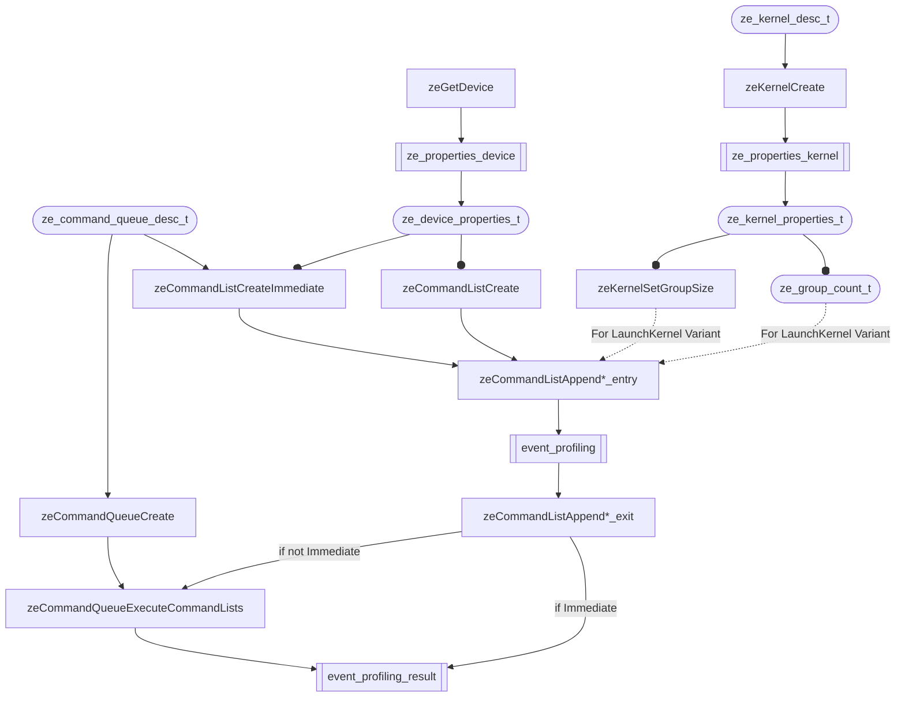

## ZE API Flow

```mermaid
graph TD
    q([ze_command_queue_desc_t])
    ep[[event_profiling]]
    epr[[event_profiling_result]]
    a[zeCommandListAppend*_entry]
    kp[[ze_properties_kernel]]
    dp[[ze_properties_device]]
    dpt([ze_device_properties_t])
    kpt([ze_kernel_properties_t])

    zeGetDevice --> dp --> dpt
    dpt --o zeCommandListCreateImmediate
    dpt --o zeCommandListCreate

    q --> zeCommandQueueCreate
    q --> zeCommandListCreateImmediate
    zeCommandListCreate          --> a
    zeCommandListCreateImmediate --> a
    k([ze_kernel_desc_t]) --> zeKernelCreate
    zeKernelCreate --> kp --> kpt
    kpt --o zeKernelSetGroupSize -. For LaunchKernel Variant .-> a
    kpt --o c([ze_group_count_t]) -. For LaunchKernel Variant .-> a
    a --> ep
    ep --> zeCommandListAppend*_exit
    zeCommandQueueCreate --> zeCommandQueueExecuteCommandLists
    zeCommandListAppend*_exit -- if not Immediate --> zeCommandQueueExecuteCommandLists
    zeCommandListAppend*_exit -- if Immediate--> epr
    zeCommandQueueExecuteCommandLists --> epr
```
