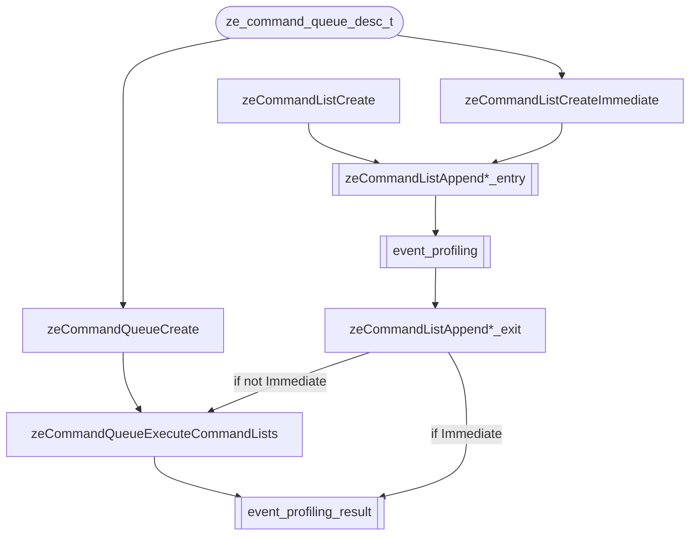

```mermaid
graph TD

    q([ze_command_queue_desc_t]) 
    ep[[event_profiling]]
    epr[[event_profiling_result]]
    a[[zeCommandListAppend*_entry]]
    q --> zeCommandQueueCreate
    q --> zeCommandListCreateImmediate
    zeCommandListCreate          --> a
    zeCommandListCreateImmediate --> a
    a --> ep
    ep --> zeCommandListAppend*_exit
    zeCommandQueueCreate --> zeCommandQueueExecuteCommandLists

    zeCommandListAppend*_exit -- if not Immediate --> zeCommandQueueExecuteCommandLists
    zeCommandListAppend*_exit -- if Immediate--> epr

    zeCommandQueueExecuteCommandLists --> epr
```
